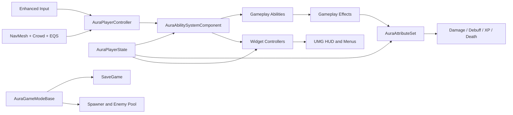

# Aura

基于 Unreal Engine 5.8 开发的局域网联机俯视角 ARPG。项目以 C++ 搭建核心框架，以 Blueprint 和数据资产装配玩法内容，覆盖 GAS 战斗、角色成长、敌人 AI、点击寻路、多人存档、死亡复活和 UMG UI。

> 当前定位是可直接连接的 Listen Server 联机游戏原型，重点验证客户端架构、服务端权威玩法和多人生命周期。项目暂未接入 OnlineSubsystem、房间发现或账号系统。

## 技术栈

`Unreal Engine 5.8` · `C++` · `Blueprint` · `Gameplay Ability System` · `Enhanced Input` · `UMG` · `MVVM` · `Behavior Tree` · `EQS` · `Recast NavMesh` · `Detour Crowd` · `Niagara` · `SaveGame`

## 核心功能

- 局域网 Listen Server 联机，服务端统一处理伤害、经验、死亡、复活、存档和地图切换。
- 基于 GAS 的主动/被动技能、技能升级与装备、冷却、资源消耗和 GameplayTag 状态控制。
- 火焰、闪电、奥术和物理伤害，以及抗性、护甲、穿透、格挡、暴击、Debuff、击退和死亡结算。
- 点击移动、手动移动和施法输入，支持静态路径规划、动态单位避让和拥堵恢复。
- 近战、远程和召唤类敌人，使用 Behavior Tree/Blackboard 完成索敌与攻击。
- 多存档槽和多人角色数据恢复，同时持久化地图中的敌人及生成器状态。
- 玩家死亡后替换 Pawn 并复用 PlayerState 中的角色数据；复活点占用时搜索最近安全 NavMesh 位置。
- 敌人、普通投射物和 FireBlast 火球对象池，减少持续战斗中的频繁 Spawn/Destroy。

## 游戏展示

1. 游戏进程

<details>
<summary>进入游戏</summary>

https://github.com/user-attachments/assets/639b3b05-bc0b-42d3-85b2-76093efa1ca5

</details>
<details>
<summary>怪物生成</summary>

https://github.com/user-attachments/assets/d64b62e8-26ff-4988-ba90-36ae56b23d30

</details>
<details>
<summary>重生</summary>

https://github.com/user-attachments/assets/52907093-11d1-445e-9e89-eb8bd014fdd0

</details>

2. 操控

<details>
<summary>转向</summary>

https://github.com/user-attachments/assets/3e704be7-5bf5-4aab-bc7d-0818a529ccdf

</details>
<details>
<summary>遮挡物虚化</summary>

https://github.com/user-attachments/assets/f0bbb7ba-9012-4c57-a12a-aaebf1147353

</details>
<details>
<summary>遮挡物虚化</summary>

https://github.com/user-attachments/assets/f0bbb7ba-9012-4c57-a12a-aaebf1147353

</details>
<details>
<summary>自动寻路与避障</summary>

https://github.com/user-attachments/assets/b335b8ec-4992-4fed-8f51-e4b7a47f79a4

</details>

3. 技能
<details>
<summary>火球</summary>

https://github.com/user-attachments/assets/b6d19a8f-230a-4e78-a90b-ba1b7328b0c0

</details>
<details>
<summary>闪电链</summary>

https://github.com/user-attachments/assets/696475ef-ffee-487d-a55d-74fa91958659

</details>
<details>
<summary>奥术地刺</summary>

https://github.com/user-attachments/assets/8fba1a7f-8bb5-4f01-b76b-a156a0646518

</details>
<details>
<summary>火球爆裂</summary>

https://github.com/user-attachments/assets/8d271ea6-c77f-4f95-ac64-0946ecb39ec3

</details>
<details>
<summary>技能升级与装备</summary>

https://github.com/user-attachments/assets/057c33cc-8729-4c59-a88a-7acbaf1b20ec

</details>
<details>
<summary>升级后的火球</summary>

https://github.com/user-attachments/assets/23c9f339-9cb6-44fb-9601-647d9ef403b5

</details>
<details>
<summary>被动技能</summary>

https://github.com/user-attachments/assets/d8237ab8-ffc6-4a30-b641-4ceecabdc816

</details>
<details>
<summary>护盾与吸血</summary>

https://github.com/user-attachments/assets/fa0064de-95eb-4bca-86eb-63b135c95615

</details>

4. 属性与场地

<details>
<summary>属性面板与加点</summary>

https://github.com/user-attachments/assets/3f478f43-0b3f-44d1-b5e0-0777db9e8c91

</details>
<details>
<summary>火焰区域</summary>

https://github.com/user-attachments/assets/b631e77b-af21-425d-9fad-1d4e059d5a3d

</details>
<details>
<summary>拾取物</summary>

https://github.com/user-attachments/assets/09fbf064-06bd-4e2d-a46b-0d1ac379cd07

</details>

5. 多人游戏

<details>
<summary>进入游戏</summary>

https://github.com/user-attachments/assets/d66733e1-1f10-4e88-a05b-982561175f09

</details>
<details>
<summary>双端同步1</summary>

https://github.com/user-attachments/assets/d99d5b18-4d0e-4a44-8601-7e4cb2890d69

</details>
<details>
<summary>双端同步2</summary>

https://github.com/user-attachments/assets/cc957314-7866-4e66-b876-d95bd5531697

</details>
<details>
<summary>双端同步3</summary>

https://github.com/user-attachments/assets/96845e99-a39b-44fa-8667-bf1a112f3fb5

</details>
<details>
<summary>存档读档</summary>

https://github.com/user-attachments/assets/6a0bebea-9e41-492a-bee9-4d75692a3e31

</details>

## 架构概览



### 玩家对象职责

- `AAuraPlayerState` 持有 ASC、AttributeSet、等级、经验和技能点，使成长状态能够跨 Pawn 重生保留。
- `AAuraCharacter` 作为当前 Avatar，负责移动、动画、摄像机、武器和 Niagara 表现。
- `AAuraPlayerController` 负责输入、鼠标目标、自动寻路、客户端 RPC 和 UI 交互。
- `AAuraGameModeBase` 只存在于服务端，负责权威存档、世界恢复、地图 Travel 和玩家复活。

## GAS 与战斗

项目不是直接在角色类中计算伤害，而是将一次命中拆成可扩展的数据管线：

```text
GameplayAbility
  -> 构造 GameplayEffectSpec / SetByCaller
  -> 服务端应用到目标 ASC
  -> Execution Calculation 计算抗性、格挡、护甲和暴击
  -> AttributeSet 消费 IncomingDamage
  -> 触发 Debuff、击退、死亡、经验和 UI 事件
```

自定义 `FAuraGameplayEffectContext` 使用 `NetSerialize` 同步暴击、Debuff 参数、伤害类型、击退和死亡冲量等命中元数据。ASC 根据对象类型采用不同复制策略：玩家使用 Mixed，敌人使用 Minimal。

技能状态由 GameplayTag 驱动，支持 `Locked -> Eligible -> Unlocked -> Equipped` 流转，并将技能等级、状态和输入槽写入存档。代表性技能包括 FireBolt、FireBlast、Electrocute、Arcane Shards，以及吸血、吸蓝和一次性护盾等被动能力。

## 联机模型

项目采用服务端权威模型：

| 行为 | 执行位置 |
| --- | --- |
| 输入采集、鼠标检测、UI | Owning Client |
| 技能本地预测 | Owning Client + GAS Prediction |
| 路径规划、动态避障、拥堵恢复 | Server |
| 投射物生成、命中、伤害、经验、死亡 | Server |
| 属性、技能 Spec、Pawn 移动 | Server Replication |
| 伤害数字、自动移动转向数据 | Client RPC |
| 地图切换、存档和世界恢复 | Server |

客户端点击目的地后通过 RPC 提交移动请求，服务端计算完整路径和 Crowd 转向速度。转向速度使用量化向量和 Unreliable Client RPC 节流发送，客户端结合 CharacterMovement 预测移动并平滑朝向。

地图切换使用相对 `ServerTravel`，使已连接客户端跟随 Listen Server 在 `MainMenu`、`LoadMenu` 和 `Dungeon` 之间切换，而不是让客户端各自执行 `OpenLevel`。

## AI 与自动寻路

自动寻路采用分层方案：

1. **Recast NavMesh**：规划到目标点或中间绕行点的全局路径。
2. **Detour Crowd**：移动过程中对玩家和怪物等动态单位进行局部速度避让。
3. **EQS 恢复查询**：检测到路径长时间没有进展时，在周围生成候选绕行点，并根据单位间距、通道净空、方向和路径代价评分。
4. **重新规划**：EQS 选出候选点后再次执行Nav；到达绕行点后重新规划到最终目标。

系统记录失败过的恢复方向并设置重规划冷却，避免在同一拥堵方向反复尝试。当前 EQS 评分包含同步路径长度查询，大量单位同时拥堵时仍有进一步分帧和两阶段筛选的优化空间。

## 存档系统

`SaveGame` 不只保存一个玩家数值，而是保存当前联机世界快照：

```text
Save Slot
  -> Maps
     -> Players
        -> Transform / Level / XP / AttributePoints / SpellPoints
        -> Health / Mana
        -> AbilityTag / Level / StatusTag / SlotTag
     -> Spawners
        -> Guid / RandomSeed / SpawnSequence / RespawnTime
     -> Enemies
        -> InstanceGuid / SpawnerGuid / Class / Transform / Level / Health
```

主要设计点：

- 使用 `FGuid` 标识敌人实例和生成器，避免依赖运行时 Actor 名称。
- 先恢复等级并重算派生属性，再恢复当前生命和法力，避免错误沿用一级角色上限。
- 玩家等待复活或 Pawn 尚未完成延迟恢复时，保留已有记录，防止默认数据覆盖有效存档。
- 支持旧版单玩家记录迁移到多人数组、重复技能压缩和存档版本升级。
- 存档写入和世界恢复仅由服务端执行，客户端不直接修改权威数据。

当前玩家归属使用会话内的稳定索引，而不是平台账号 ID。若扩展为正式在线游戏，应改为 `UniqueNetId` 或持久化玩家 GUID 到存档记录的映射。

## UI 架构

UI 根据业务形态使用两种分层方式，而不是在同一个界面重复套用两套架构：

| UI 模块 | 模式 | 数据流 |
| --- | --- | --- |
| 战斗 HUD、属性菜单、技能菜单 | MVC | PlayerState、ASC、AttributeSet -> WidgetController Delegate -> UMG |
| 加载界面、存档槽 | MVVM | SaveGame/GameMode -> ViewModel FieldNotify -> View Binding |

WidgetController 负责聚合 GAS 和成长数据，Widget 只处理显示与交互；存档界面使用 UE ModelViewViewModel 插件完成三个存档槽的新建、选择、删除和进入游戏流程。

## 目录结构

```text
Aura/
├─ Config/                         项目、GAS、GameplayTag 和打包配置
├─ Content/
│  ├─ Blueprints/                  GA/GE、角色、UI、AI 和数据资产
│  └─ Maps/                        MainMenu、LoadMenu、Dungeon
├─ Source/Aura/
│  ├─ Public/                      对外头文件和可扩展接口
│  │  ├─ AbilitySystem/            ASC、AttributeSet、Ability、ExecCalc、Cue
│  │  ├─ Game/                     GameMode、GameInstance、SaveGame
│  │  ├─ Navigation/               CrowdFollowing 扩展
│  │  └─ UI/                       HUD、Widget、WidgetController、ViewModel
│  └─ Private/                     对应模块实现，以及 Actor、AI、Character、Player、Subsystem
└─ Aura.uproject
```

## 开发环境

- Windows 10/11
- Unreal Engine 5.8
- Rider
- Git LFS

## 局域网联机

当前没有房间搜索 UI，需要使用直接 IP 连接。主机启动 Listen Server，客户端连接主机局域网 IPv4 地址：

```powershell
# 主机
.\Aura.exe /Game/Maps/MainMenu?listen -port=7777

# 客户端，将地址替换为主机的局域网 IPv4
.\Aura.exe 192.168.1.100:7777
```

需要确保两台电脑使用相同构建版本，并在 Windows 防火墙中允许游戏使用 UDP 7777。连接建立后，地图切换由主机的 `ServerTravel` 统一驱动。

## 已知边界与后续计划

- 接入 OnlineSubsystem，补充创建、搜索和加入 Session 的完整大厅流程。
- 使用持久玩家 ID 替代会话索引，支持玩家交换加入顺序及断线重连后的正确存档归属。
- 将 EQS 拥堵恢复改为低成本预筛选 + 少量候选验证，并将多单位重规划分散到不同帧。
- 补充 Automation/Functional Test，覆盖伤害公式、技能状态迁移、存档升级和多人 Travel。
- 增加正式性能采样数据，而不是仅以对象池和查询节流推断优化效果。
